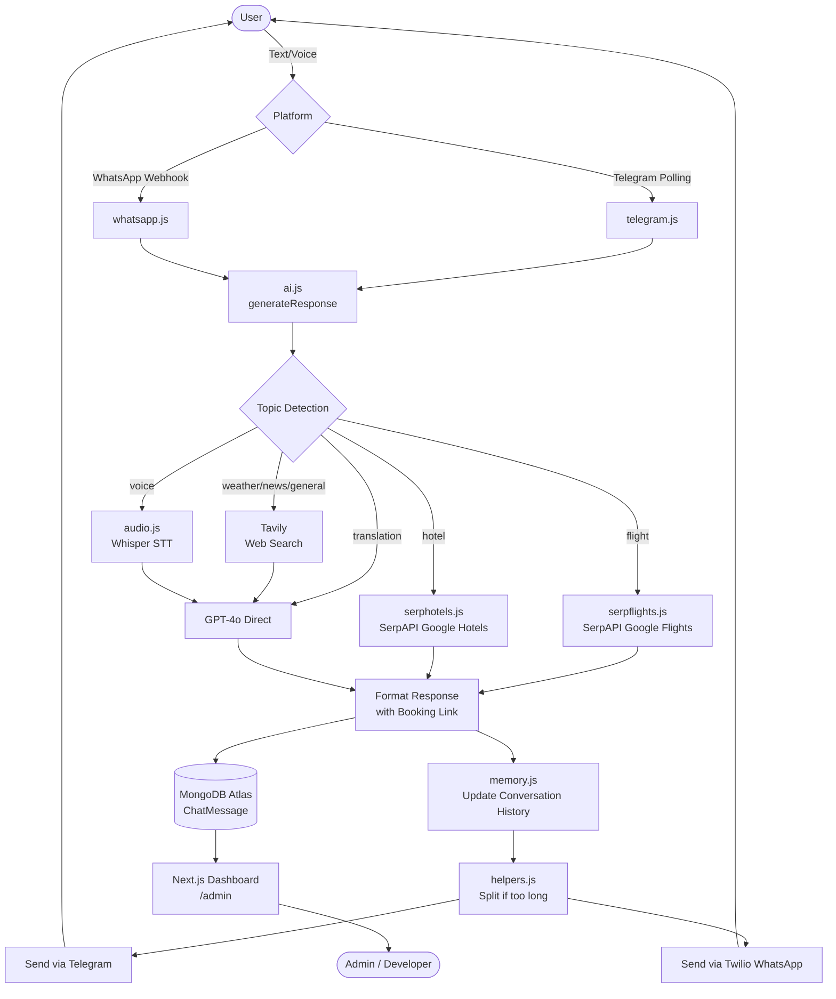
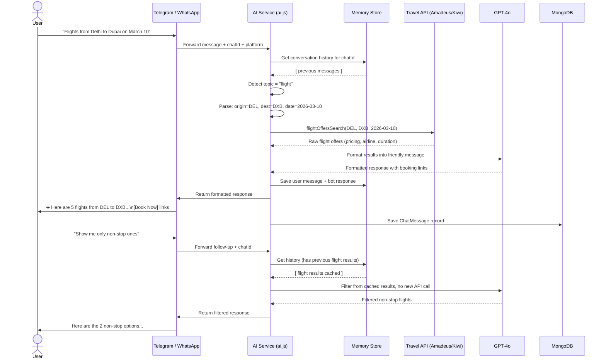
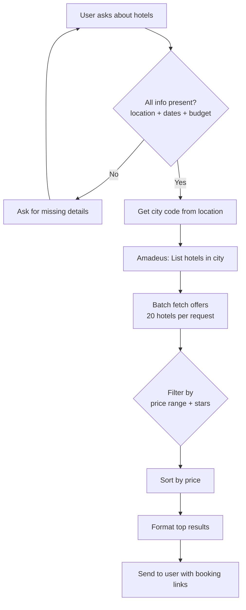
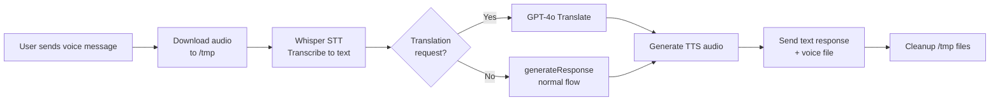

# Project Handover: DxbCare AI Travel Agent

> **Purpose of this document:** Full project rundown for senior developer onboarding — covers what we're building, current state, all design decisions, and complete data/user flow diagrams.

---

## 1. What We're Building

**DxbCare** is a multi-platform AI-powered travel assistant chatbot. Users interact with it via **Telegram** and **WhatsApp** to get real-time travel help — flight searches, hotel recommendations, visa info, weather, and general Q&A — all through natural conversation.

The goal is a single AI agent that:
- Understands natural language travel queries
- Returns **real, accurate, live-priced** results (not static/cached data)
- Provides a **direct booking link** so the user clicks one button to book
- Works on both Telegram and WhatsApp with identical capability
- Has an **admin dashboard** (web) to view all user conversations

---

## 2. What Has Been Done

### Infrastructure
- [x] Node.js + Express backend server (bot engine) running on port `3001`
- [x] Next.js frontend dashboard running on port `3000`
- [x] MongoDB Atlas connected for persistent chat history
- [x] `.env.local` set up with all API credentials

### Bot Platforms
- [x] **Telegram bot** — fully integrated via polling (`node-telegram-bot-api`)
- [x] **WhatsApp bot** — fully integrated via Twilio webhooks (`/webhook/whatsapp`)

### AI Core
- [x] GPT-4o via Vercel AI SDK (`@ai-sdk/openai`) for all text generation
- [x] OpenAI Whisper for voice message transcription
- [x] OpenAI TTS for voice response generation
- [x] Tavily for real-time web search (news, weather, general questions)

### Travel APIs
- [x] **SerpAPI Google Flights** integrated (`serpflights.js`) — returns live pricing, airlines, durations, stops, direct booking deep links
- [x] **SerpAPI Google Hotels** integrated (`serphotels.js`) — returns live hotel offers with pricing, ratings, reviews, amenities, and direct booking links
- [x] Natural language date/location parsing for both flights and hotels
- [x] Conversation continuity — follow-up questions work without re-specifying context

### Data Layer
- [x] MongoDB schema: `ChatMessage` — stores every conversation turn
- [x] In-memory conversation history (per session) for fast context retrieval
- [x] Topic tracking — detects topic changes (flights → hotels) and resets context

### Admin Dashboard
- [x] `/admin` page shows all users and their conversations
- [x] Platform badge (Telegram/WhatsApp), message count, last message preview
- [x] Drill-down into any user's full chat history

### Pending / In Progress
- [ ] Swap Amadeus flights → **Kiwi Tequila API** (for booking deep links + better global accuracy)
- [ ] Integrate **Booking.com Affiliate API** for hotels (direct booking links + commission)
- [ ] Authentication on admin dashboard
- [ ] Production deployment (webhook URL for Telegram, public domain for WhatsApp)

---

## 3. Tech Stack

| Layer | Technology |
|-------|-----------|
| Bot Runtime | Node.js + Express |
| AI Framework | Vercel AI SDK (`ai`, `@ai-sdk/openai`) |
| LLM | OpenAI GPT-4o |
| Voice | OpenAI Whisper (STT) + OpenAI TTS |
| Web Search | Tavily |
| Telegram | `node-telegram-bot-api` (polling) |
| WhatsApp | Twilio (`twilio` SDK) |
| Flight Search | Amadeus SDK (`amadeus`) |
| Hotel Search | Amadeus SDK (`amadeus`) |
| Database | MongoDB Atlas via Mongoose |
| Frontend | Next.js 16 + React 19 + Tailwind CSS 4 |
| Config | `.env.local` → `src/config/index.js` |

---

## 4. Project Structure

```
/agent
├── bot.js                          # Entry point — starts Express + Telegram polling + MongoDB
├── package.json
├── .env.local                      # All credentials (never commit)
├── next.config.ts                  # Next.js config
│
├── src/
│   ├── config/
│   │   └── index.js               # Centralized env var loader
│   │
│   ├── services/
│   │   ├── ai.js                  # Core AI logic — topic routing, GPT-4o calls, search dispatch
│   │   ├── telegram.js            # Telegram message handler
│   │   ├── whatsapp.js            # WhatsApp/Twilio message handler + webhook
│   │   ├── serpflights.js         # SerpAPI Google Flights wrapper (live pricing + booking links)
│   │   ├── serphotels.js          # SerpAPI Google Hotels wrapper (live pricing + booking links)
│   │   ├── audio.js               # Whisper transcription + TTS generation
│   │   └── chatHistory.js         # MongoDB read/write layer
│   │
│   └── utils/
│       ├── memory.js              # In-memory conversation + topic store
│       └── helpers.js             # Message splitting, search detection utils
│
└── src/app/                        # Next.js app router
    ├── layout.tsx
    ├── page.tsx                    # Home/status page
    ├── admin/page.tsx              # Admin chat dashboard
    └── api/chats/
        ├── route.ts               # GET /api/chats — user list
        └── [chatId]/route.ts      # GET /api/chats/:id — user messages
```

---

## 5. Design Decisions

### 5.1 Polling vs Webhooks
- **Telegram uses polling** — simpler to run locally, no public URL needed for dev. Trade-off: slight latency, but negligible for chat.
- **WhatsApp uses webhooks** — Twilio requires it. Express serves the `/webhook/whatsapp` endpoint. Needs a public URL in production (ngrok for dev).

### 5.2 In-Memory + MongoDB Dual Storage
- **In-memory (`memory.js`):** Conversation history lives in a `Map` keyed by `chatId`. Fast reads, no async overhead. Lost on restart — intentional (fresh context per session).
- **MongoDB:** Permanent record of every message. Used for admin dashboard only, not injected back into AI context.
- **Decision:** AI does not use DB history for responses — prevents stale context from old sessions poisoning new conversations.

### 5.3 Topic-Based Context Management
Each user has a tracked "topic" (flight, hotel, visa, weather, etc.). When the topic changes, conversation history is cleared. This prevents the AI from confusing a hotel query with a previous flight conversation.

### 5.4 Amadeus for Travel (being replaced)
Amadeus was chosen initially for both flights and hotels — good global coverage and a generous free tier. **However**, Amadeus does not return direct booking links. Decision made to replace:
- Flights → **Kiwi Tequila API** (deep booking links, 10x free tier, faster)
- Hotels → **Booking.com Affiliate API** (direct booking links, largest inventory, affiliate revenue)

### 5.5 Single AI Entry Point
All queries (regardless of platform or query type) go through `ai.js → generateResponse()`. This function internally routes to specialized handlers. Keeps platform-specific code clean and only responsible for message I/O.

### 5.6 Message Splitting
Platform character limits differ:
- Telegram: 4,096 chars → split at 4,000
- WhatsApp: ~1,600 chars → split at 1,550

Splitting is done at newline/space boundaries (not mid-word). Logic lives in `helpers.js`.

### 5.7 Graceful Fallback Chain
```
Specialized API (Amadeus/Kiwi) fails
    → Tavily web search fallback
        → GPT-4o general knowledge fallback
            → User-friendly error message
```

### 5.8 Frontend Isolation
The Next.js dashboard is a completely separate runtime (port 3000) from the bot (port 3001). They share MongoDB as the common data layer. No direct coupling between bot and dashboard code.

---

## 6. API Credentials Summary

| API | Env Var(s) | Current Provider |
|-----|-----------|-----------------|
| OpenAI (GPT-4o, Whisper, TTS) | `OPENAI_API_KEY` | OpenAI |
| Telegram | `TELEGRAM_BOT_TOKEN` | BotFather |
| WhatsApp | `TWILIO_ACCOUNT_SID`, `TWILIO_AUTH_TOKEN`, `TWILIO_WHATSAPP_NUMBER` | Twilio |
| Flight Search | `AMADEUS_CLIENT_ID`, `AMADEUS_CLIENT_SECRET` | Amadeus (to be replaced) |
| Hotel Search | Same as above | Amadeus (to be replaced) |
| Web Search | `TAVILY_API_KEY` | Tavily |
| Database | `MONGODB_URI` | MongoDB Atlas |

---

## 7. Data Flow Diagram



---

## 8. User Flow Diagram



---

## 9. Hotel Search Flow (Multi-Step Validation)



---

## 10. Voice Message Flow



---

## 11. What the Senior Dev Needs to Decide

1. **SerpAPI flights + hotels** — ✅ Done. Both now use SerpAPI with direct booking links.
3. **Production deployment strategy** — Telegram needs webhook (or keep polling), WhatsApp needs public HTTPS URL for Twilio.
4. **Admin dashboard auth** — currently no login, anyone with the URL can see all chats.
5. **Rate limiting / abuse prevention** — no limits currently on how many requests a single user can make.
6. **Multi-user scalability** — in-memory store is per-process; if we scale horizontally, memory won't be shared. Consider Redis for session state.
7. **Booking commission flow** — Booking.com affiliate earns commission per booking. Need account setup.

---

## 12. Running the Project

```bash
# Install dependencies
npm install

# Run bot (port 3001)
node bot.js

# Run dashboard (port 3000) — in a separate terminal
npm run dev

# For WhatsApp webhooks in dev, expose port 3001
npx ngrok http 3001
# Then set Twilio webhook URL to: https://<ngrok-url>/webhook/whatsapp
```

Environment file: `.env.local` — all keys already filled in, ask Keshav for the file.
